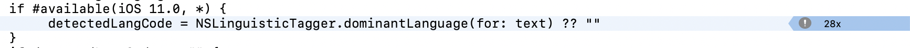
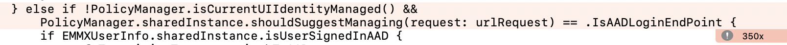

# **Tips of Coding Style**

**Good habits make a good life.**

### After focus on Microsoft Edge performance improement for few days. I'd like to raise some advice here. You might think it's simple, but it's still deserve review.

## **1. Don't repeat**
When user swipe on webview, Edge will auto show/hide address bar. Here we need to get address bar's height.

```Swift
static var height: CGFloat {
        return EMMXHeaderViewController.Heights.searchBoxHeight
            + (SizeClassManager.shared.isSizeClassLarge ? 0 : 2 * EMMXHeaderViewController.Heights.stackViewTopBottomPadding)
            + (SizeClassManager.shared.isSizeClassLarge ? 10 : 0)
            + EMMXHeaderViewController.Heights.separatorLineHeight
            + (SizeClassManager.shared.isSizeClassLarge ? EMMXHeaderViewController.Heights.tabBarHeight : 0)
    }
```

It's simple calculation, right? <br/>
But it will calculate Whenever user swipe. Then it might affect UI Thread.

So I change it as following, only calculate once.

```Swift
static var height: CGFloat {
        return SizeClassManager.shared.isSizeClassLarge ? EMMXHeaderViewController.largeSizeHeight : EMMXHeaderViewController.normalSizeHeight
    }

    static let largeSizeHeight: CGFloat = EMMXHeaderViewController.Heights.searchBoxHeight
            + EMMXHeaderViewController.Heights.separatorLineHeight
            + EMMXHeaderViewController.Heights.tabBarHeight
            + 10
    
    static let normalSizeHeight: CGFloat = EMMXHeaderViewController.Heights.searchBoxHeight
            + EMMXHeaderViewController.Heights.separatorLineHeight
            + 2 * EMMXHeaderViewController.Heights.stackViewTopBottomPadding
```

## **2. Don’t belittle a single statement**
One single line maybe cost more than 100ms on UI thread. That would be a disaster if run on UI Thread.
Such as:<br/>




**The best solution is post on worker thread**


# **To be continued**


